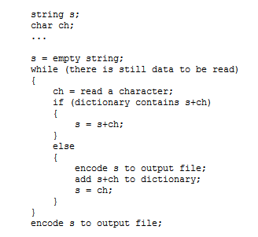
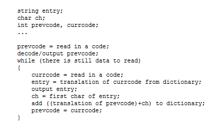

# Toteutus

## LempelZivWelch

**Pakkausalgoritmi** saa syötteenä taulukon tavuja, jotka kuvaavat ASCII-merkistön symboleita.
Luettuja symboleita yhdistetään merkkijonoiksi, jotka lisätään ns. sanakirjaan, joka sisältää
merkkijono-koodi -pareja. Hajautustaululla toteutettu sanakirja sisältää alussa kaikki 256 ASCII-symbolia, 
ja kun sen maksimikoko (4096) saavutetaan, se resetoidaan takaisin tuohon alkutilaan.
Koodit ovat 12-bitin kokoisia, ja ne kootaan yhteen käyttäen luokkaa ByteArrayOutputStream.
Algoritmi palauttaa taulukon tavuja.

Pakkausalgoritmi pohjautuu seuraavaan pseudokoodiin:

**lähde: https://www.cs.duke.edu/csed/curious/compression/lzw.html**

**Purkamisalgoritmi** saa myös syötteenä taulukon tavuja, joka sisältää 12-bittisiä koodeja. Koodit 
käännetään merkkijonoiksi sanakirjan avulla, mutta nyt koodit ovat avaimia. Sanakirjaa täydennetään taas 
syötettä luettaessa, mutta erilaisella periaatteella. Taas käytetään ByteArrayOutputStream.

Purkamisalgoritmi pohjautuu seuraavaan pseudokoodiin:

**lähde: https://www.cs.duke.edu/csed/curious/compression/lzw.html**

### Aika- ja tilavaativuudet

**Pakkaus**

Alussa luodaan sanakirja; varataan vakiomäärä tilaa ja lisätään vakiomäärä pareja. Tilavaativuus 
siis O(1) ja niin on myös keskimääräinen aikavaativuus (hajautustaulun insert-operaation keskimääräinen 
aikavaativuus on O(1), pahin on O(n)).

Tämän jälkeen käydään n kokoinen syöte läpi yksi kerrallaan, koko ajan muodostaen uusia merkkijonoja,
jotka lisätään sanakirjaan, aikavaativuus on siis O(n). Pahimmassa tapauksessa aikavaativuus
on O(n^2) (hajautustaulun pahimman tapauksen takia). 

Koodeille muodostetaan taulu ByteArrayOutputStream:in kautta, jonka koko riippuu syötteen pituudesta, eli
tilavaativuus on O(n) 

Eli pakkausalgoritmin aikavaativuus on keskimäärin O(n), ja tilavaativuus on O(n).

**Purkaminen**

Alussa luodaan sanakirja samalla tavalla kuin pakatessa, aika- ja tilavaativuudet samat.

Syöte käydään läpi koodi kerrallaan, sanakirjaan lisätään pareja (aikavaativuus keskimäärin O (1), pahin O(n)).
ByteArrayOutputStream:iin kirjoitetaan sanakirjasta löydetyt merkkijonot kirjain kerrallaan (aikavaativuus O(n)), 
ja lopussa se sisältää n kokoisen merkkijonon (tilavaativuus O(n)).

Eli myös purkamisalgoritmin aikavaativuus on keskimäärin O(n), ja tilavaativuus on O(n).

### Paranneltavaa

Toteutuksen pahin puute on 12 bittiset koodit. Olisi tietenkin tehokkaampaa jos käytettäisiin ns. variable-length -koodeja. Lisäksi, koodeja ei kirjoiteta tiivisti eli jokaiseen kuuluu 8 turhaa nollabittiä.

## Huffman

Tämä valmiiksi sitten kuin Huffmanista on oikea versio (toivottavasti ensi viikolla)

## LZW VS Huffman

--||--