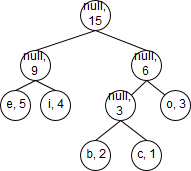
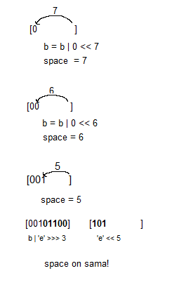

# Toteutus

## LempelZivWelch

**Pakkausalgoritmi** saa syötteenä taulukon tavuja, jotka kuvaavat ASCII-merkistön symboleita.
Luettuja symboleita yhdistetään merkkijonoiksi, jotka lisätään ns. sanakirjaan, joka sisältää
merkkijono-koodi -pareja. Hajautustaululla toteutettu sanakirja sisältää alussa kaikki 256 ASCII-symbolia, 
ja kun sen maksimikoko (4096) saavutetaan, se resetoidaan takaisin alkutilaan.
Koodit ovat 12-bitin kokoisia, ja ne kootaan yhteen käyttäen luokkaa ByteArrayOutputStream.
Algoritmi palauttaa taulukon tavuja.

Pakkausalgoritmi pohjautuu seuraavaan pseudokoodiin:

**lähde: https://www.cs.duke.edu/csed/curious/compression/lzw.html**

**Purkamisalgoritmi** saa myös syötteenä taulukon tavuja, joka sisältää 12-bittisiä koodeja. Koodit 
käännetään merkkijonoiksi sanakirjan avulla, mutta nyt koodit ovat avaimia. Sanakirjaa täydennetään taas 
syötettä luettaessa, mutta erilaisella periaatteella. Taas käytetään ByteArrayOutputStream.

Purkamisalgoritmi pohjautuu seuraavaan pseudokoodiin:

**lähde: https://www.cs.duke.edu/csed/curious/compression/lzw.html**

### Aika- ja tilavaativuudet

**Pakkaus**

Alussa luodaan sanakirja; varataan vakiomäärä tilaa ja lisätään vakiomäärä pareja. Tilavaativuus 
siis O(1) ja niin on myös keskimääräinen aikavaativuus (hajautustaulun insert-operaation keskimääräinen 
aikavaativuus on O(1), pahin on O(n)).

Tämän jälkeen käydään n kokoinen syöte läpi yksi kerrallaan, koko ajan muodostaen uusia merkkijonoja,
jotka lisätään sanakirjaan, aikavaativuus on siis O(n). Pahimmassa tapauksessa aikavaativuus
on O(n^2) (hajautustaulun pahimman tapauksen takia). 

Koodeille muodostetaan taulu ByteArrayOutputStream:in kautta, jonka koko riippuu syötteen pituudesta, eli
tilavaativuus on O(n) 

Eli pakkausalgoritmin aikavaativuus on keskimäärin O(n), ja tilavaativuus on O(n).

**Purkaminen**

Alussa luodaan sanakirja samalla tavalla kuin pakatessa, aika- ja tilavaativuudet samat.

Syöte käydään läpi koodi kerrallaan, sanakirjaan lisätään pareja (aikavaativuus keskimäärin O (1), pahin O(n)).
ByteArrayOutputStream:iin kirjoitetaan sanakirjasta löydetyt merkkijonot kirjain kerrallaan (aikavaativuus O(n)), 
ja lopussa se sisältää n kokoisen merkkijonon (tilavaativuus O(n)).

Eli myös purkamisalgoritmin aikavaativuus on keskimäärin O(n), ja tilavaativuus on O(n).

### Paranneltavaa

Toteutuksen pahin puute on 12 bittiset koodit. Olisi tietenkin tehokkaampaa jos käytettäisiin ns. variable-length -koodeja.
Lisäksi, koodeja ei kirjoiteta tiivisti eli jokaiseen kuuluu 4 turhaa nollabittiä.

## Huffman

Käytetään esimerkkinä syötettä "cbboooiiiieeeee"

**Pakkaus**

Alussa TreeBuilder-luokkaa käyttäen luodaan HuffmanTree-puurakenne:

Tavut käydään läpi tallettaen merkkien esiintymismäärät. Tämän tiedon avulla luodaan jokaiselle esiintyvälle merkille oma
HuffmanNode-olio, joka sisältää merkkijonon ja sen esiintymismäärän. Solmut laitetaan prioriteettijonoon, jossa ensimmäisen alkion
merkin esiintymismäärä on pienin.
Jono tyhjennetään kaksi alkiota kerrallaan; kaksi solmua, joiden merkkien esiintymismäärät ovat pienimmät, yhdistetään uudeksi
null-solmuksi, jonka frekvenssiarvo on näiden solmujen merkkifrekvenssien summa.
Kun viimeinen solmu löydetään, se asetetaan puun juureksi. Lisäksi puulle annetaan lehdet sisältävän taulukon, jonka avulla puusta etsitään
koodeja. Saadaan seuraava puu:

Tämän jälkeen luodaan pakattujen bittien alkuun tuleva header, jonka avulla luodaan puu pakattuja bittejä purkaessa:

Puu käydään rekursiivisesti läpi esijärjestyksessä. Kun käsittelyyn tulee null-solmu, kirjoitetaan ByteArrayWriter-
luokan avulla 0-bitti, ja lehtien tapauksessa kirjoitetaan 1-bitti ja lehden merkin ASCII-koodi.
ByteArrayWriter kirjoittaa bittejä työntäen ne vasemmalle puolelle.
Seuraava kuva esittää luokan toimintaa:

Saatu header on (ilman välejä ja sulkuja)
0  0  1  01100101(e)  1  01101001(i)  0  0  1  01100010(b)  1  01100011(c)  1  01101111(o)

Nyt parametrina saadut tavut käydään taas läpi, ja jokaiselle etsitään puusta koodi:
Haetaan lehtitaulukosta merkin sisältävä lehti, ja liikutaan ylöspäin juurta kohti. Koodin "bitit" lisätään pinoon, koska muuten ne 
olisivat väärinpäin. Esim. esimerkkipuusta saadaan koodi 010 merkille 'c'.

Koodit kirjoitetaan taas taulukkoon ByteArrayWriter-luokalla. Kun kutsutaan toByteArray-metodia, true arvolla ilmaistaan, että
loppuun kirjoitetaan eof-tavu, jonka arvo kertoo, kuinka monta bittiä luetaan "viimeisestä" tavusta (oikeasti toiseksi viimeinen).

Saadaan: 

010 011 011 00 00 00 10 10 10 10 11 11 11 11 11 1(eof)

tavuina: 

[01001101][10000001][01010101[11111111][10000000][00000001]

**Purkaminen**

Alussa rakennetaan puu uudestaan headerin kautta TreeBuilder-luokalla:

Jos luetaan 0-bitti, luodaan null-solmu, asetetaan se käsittelyssä olevan solmun vasemmaksi lapseksi, ja siirrytään
sen käsittelyyn. Jos luetaan 1-bitti, luodaan solmu jonka merkki saadaan lukemalla seuraavat 8 bittiä, ja 
asetetaan se vasemmaksi lapseksi. Sama sitten tehdään, jotta saadaan luotua oikeanpuoleinen lapsi. 
Lopussa palautetaan puun ja headerin jälkeen tulevat tavut.

Tämän jälkeen loput tavut luetaan yksi bitti kerralla kerrallaan. Samalla aikaa puuta käydään läpi. Kun luetaan 1-bitti, siirrytään
vasemmalle, muuten oikealle. Kun lehti löydetään, siirrytään takaisin juureen.

### Aika- ja tilavaativuudet

Syötteen koko tavuina on n ja eri merkkien määrä on k.

#### Pakkaus

**Luodaan puu:**

* Käydään syöte läpi, O(n)
* Lisätään prioriteettijonoon k alkiota, sitten poistetaan, O(k log k)
* Aikavaativuus siis O(n + k log k)
* Tilavaativuus: O(k) (prioriteettijono ja puu)

**Luodaan header:**

* Käydään puu rekursiivisesti läpi, O(k)
* Tilavaativuus: O(log k) (rekursiopino)

**Käydään syöte läpi**

* Käsiteltävälle tavulle etsitään puusta koodi, aikavaativuus ja tilavaativuus O(log k) (keskimääräinen koodin pituus)
* Kirjoitetaan etsitty koodi bitti kerrallaan , aikavaativuus O(log k) 
* Aikavaativuus siis O(n log k)
* Tilavaativuus: O(n + k) (pakattu data ja puu)

#### Purkaminen

**Luodaan puu:**

* Aikavaativuus O(k)
* Tilavaativuus O(log k) (rekursiopino)

**Luetaan pakattu data:**

* Etsitään puusta lehtiä yhteensä n kertaa; aikavaativuus O(n log k) 
* Tilavaativuus O(n) purettu data

##### Molempien keskimääräinen aikavaativuus on O(n log k)

### Paranneltavaa

Pakkaminen voitaisiin toteuttaa purkamisen tapaan, niin, että koodeja kirjoitetaan samalla kun liikutaan puuta pitkin. 

Muutakin varmaan löytyy...

